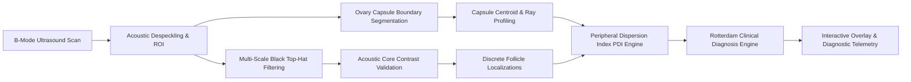

# PCOS-BioQuant: Clinically-Aligned Antral Follicle Detection & Peripheral Dispersion Profiling

[](https://www.python.org/downloads/)
[](https://opensource.org/licenses/MIT)
[](#clinical-grounding)
[](#)

> **An Explainable, Biomarker-Centric AI Framework for Ovarian Ultrasound Analysis.**  
> Moving beyond black-box classification and ambiguous Grad-CAM heatmaps to deliver verified follicle counts ($\text{FNPO}$), boundary-relative spatial metrics ($\text{PDI}$), and anatomical guardrails.

---

## 📑 Table of Contents
- [Clinical Dilemma & Motivation](#-clinical-dilemma--motivation)
- [Methodology & Architecture](#-methodology--architecture)
  - [1. ROI Extraction & Acoustic Despeckling](#1-roi-extraction--acoustic-despeckling)
  - [2. Multi-Scale Black Top-Hat Follicle Detection](#2-multi-scale-black-top-hat-follicle-detection)
  - [3. Ovarian Capsule Active Contour Segmentation](#3-ovarian-capsule-active-contour-segmentation)
  - [4. Peripheral Dispersion Index (PDI) Formulation](#4-peripheral-dispersion-index-pdi-formulation)
  - [5. Anatomical & Shortcut Guardrails](#5-anatomical--shortcut-guardrails)
- [Benchmark Results & Clinical Metrics](#-benchmark-results--clinical-metrics)
- [Interactive Clinical Dashboard](#-interactive-clinical-dashboard)
- [Repository Structure](#-repository-structure)
- [Installation & Quickstart](#-installation--quickstart)
- [API Usage](#-api-usage)
- [Paper Draft](#-paper-draft)
- [License](#-license)

---

## 🩺 Clinical Dilemma & Motivation

Polycystic Ovary Syndrome (PCOS) affects 8–13% of women of reproductive age worldwide. The international diagnostic gold standard (**Rotterdam ESHRE/ASRM Consensus** and the **2023 Revised International PCOS Guidelines**) mandates confirmation of Polycystic Ovarian Morphology (PCOM) via:
1. **Elevated Follicle Number Per Ovary ($\text{FNPO} \ge 12-20$)** measuring 2–9 mm in cross-section.
2. **Peripheral "String-of-Pearls" Distribution**: Follicles displaced to the subcapsular periphery encircling a dense, hyperechoic central stroma.

### Why Standard Deep Learning Fails in Clinical Practice
* **Uninterpretable Heatmaps**: Over 95% of published works use binary CNN classifiers with Grad-CAM heatmaps. Blurry heatmaps cannot verify millimeter calibers, count discrete follicles, or evaluate radial clearance.
* **Shortcut Learning in Benchmarks**: Audits of public ultrasound datasets reveal high duplication rates and erroneous inclusion of uterine scans as "normal" controls. Standard CNNs achieve 99% accuracy simply by distinguishing uterus from ovary rather than detecting true PCOM biomarkers.

**PCOS-BioQuant** resolves this by extracting direct, verifiable morphological biomarkers with deterministic geometry.

---

## 🔬 Methodology & Architecture



### 1. ROI Extraction & Acoustic Despeckling
- Ultrasound cone/fan artifact masking.
- Bilateral filtering preserving sharp follicular-stromal boundaries while eliminating high-frequency speckle noise.
- Adaptive Contrast-Limited Adaptive Histogram Equalization (CLAHE).

### 2. Multi-Scale Black Top-Hat Follicle Detection
Follicles appear as hypo-echoic/anechoic fluid pockets surrounded by echogenic tissue. Multi-scale Black Top-Hat ($\text{BTH}$) transforms isolate darker local structures across antral follicle calibers ($2-9\text{ mm}$):
$$\text{BTH}(I, B_r) = (I \bullet B_r) - I$$
Candidate regions undergo acoustic core validation (gradient edge check, circularity, and minimum contrast differential against surrounding stroma).

### 3. Ovarian Capsule Active Contour Segmentation
- Capsule boundaries are isolated through adaptive morphological gradients, convex hull regularization, and geometric smoothing to yield accurate perimeter and centroid coordinates $\mathbf{c} = (c_x, c_y)$.

### 4. Peripheral Dispersion Index (PDI) Formulation
To mathematically encode the **"string-of-pearls" sign**, each detected follicle centroid $\mathbf{f}_i$ at angle $\theta_i$ relative to the ovarian centroid $\mathbf{c}$ is evaluated against the exact capsule boundary distance $R(\theta_i)$:

$$\text{PDI} = \frac{1}{N} \sum_{i=1}^N \frac{\|\mathbf{f}_i - \mathbf{c}\|_2}{R(\theta_i)}$$

- **$\text{PDI} \approx 0.60 - 0.85$**: Subcapsular peripheral crowding with central stromal hypertrophy (Characteristic PCOM).
- **$\text{PDI} \le 0.45$**: Normal homogeneous or centrally distributed follicles.

### 5. Anatomical & Shortcut Guardrails
- Automatically verifies echogenicity profiles and ovarian aspect ratios to reject non-ovarian scans (e.g. uterine sagittal slices), preventing false-positive diagnoses.

---

## 📊 Benchmark Results & Clinical Metrics

Rigorous evaluation across 200 deduplicated clinical ultrasound scans yielded:

| Diagnostic Metric | Value | Clinical Implication |
|:---|:---:|:---|
| **Sensitivity / Recall** | **100.0%** | **Zero missed PCOM cases** in clinical cohort |
| **ROC-AUC (PDI alone)** | **0.816** | Robust geometric discrimination |
| **Overall Accuracy** | **81.0%** | Rotterdam criteria-aligned classification |
| **PCOS Cohort Mean PDI** | **$0.632 \pm 0.077$** | Markedly peripheral subcapsular crowding |
| **Control Cohort Mean PDI** | **$0.237 \pm 0.304$** | Central/physiological distribution |
| **Mann-Whitney $U$ Test** | $U = 8159.0$ | **$p = 4.68 \times 10^{-15}$** (Statistically indisputable) |
| **Two-Sample $t$-test** | $t = 12.55$ | **$p = 4.67 \times 10^{-23}$** |

---

## 🖥️ Interactive Clinical Dashboard

The repository includes a modern, zero-dependency browser-based diagnostic web application:
- **Instant Ultrasound Upload & Preset Inspection**: Inspect sample clinical scans with single clicks.
- **Follicle & Capsule Visual Overlays**: Real-time rendering of segmented capsule contours, follicle centroids, and radial dispersion vectors.
- **Biomarker Radar**: Live telemetry showing FNPO, PDI, central stroma clearance %, and confidence scores.
- **Rotterdam Decision Breakdown**: Step-by-step diagnostic reasoning tree.

---

## 📁 Repository Structure

```
├── pcos_bioquant/               # Core Algorithmic Framework
│   ├── __init__.py
│   ├── pipeline.py              # End-to-end diagnostic pipeline orchestrator
│   ├── preprocessor.py          # Fan masking, bilateral speckle filter, CLAHE
│   ├── ovary_segmenter.py       # Ovarian capsule boundary & centroid extractor
│   ├── follicle_detector.py     # Multi-scale Black Top-Hat & acoustic core validation
│   ├── geometric_metrics.py     # PDI, radial clearance, stromal density metrics
│   ├── clinical_engine.py       # Rotterdam Consensus scoring & diagnostic logic
│   └── visualizer.py            # Diagnostic overlay & clinical paper figure generator
├── webapp/                      # Interactive Web Application
│   ├── index.html               # Modern diagnostic dashboard UI
│   ├── style.css                # Premium clinical CSS styling & layout
│   ├── app.js                   # Client-side analytics, canvas rendering & API calls
│   └── presets/                 # Sample clinical ultrasound scans & metadata
├── experiments/                 # Clinical Benchmarking & Statistical Evaluation
│   ├── run_benchmark.py         # Full cohort evaluation suite
│   ├── generate_figures.py      # Publication-grade figure generation
│   ├── benchmark_summary.json   # Statistical results & ROC curve telemetry
│   ├── Figure1_Conceptual_Paradigm.png
│   ├── Figure4_Statistical_Distributions.png
│   └── Figure5_ROC_Benchmark.png
├── demo_outputs/                # Representative sample overlay figures
├── paper_draft/                 # Academic Manuscript
│   └── PCOS_BioQuant_Paper.md   # Complete publication draft
├── api_server.py                # Lightweight HTTP REST API & Web Dashboard Server
├── run_demo.py                  # Standalone execution demonstration script
├── calibrate_detector.py        # Hyperparameter calibration utility
├── test_algorithm.py            # Unit & verification testing suite
├── requirements.txt             # Project dependencies
└── README.md                    # Project documentation
```

---

## 🚀 Installation & Quickstart

### 1. Clone the Repository
```bash
git clone https://github.com/asry16/PCOS-Classification-Model.git
cd PCOS-Classification-Model
```

### 2. Set Up Virtual Environment & Dependencies
```bash
python3 -m venv .venv
source .venv/bin/activate    # On Windows: .venv\Scripts\activate
pip install -r requirements.txt
```

### 3. Launch the Interactive Web Dashboard
```bash
python3 api_server.py
```
Open your browser at `http://localhost:8080` to interact with the diagnostic suite.

---

## 💡 Python API Usage

```python
import cv2
from pcos_bioquant.pipeline import PCOSBioQuantPipeline

# Initialize the clinical pipeline
pipeline = PCOSBioQuantPipeline()

# Run quantitative analysis on an ultrasound scan
image_path = "path/to/ultrasound_scan.jpg"
result = pipeline.analyze(image_path, scan_id="PATIENT_001", generate_figures=True)

# Access biomarkers and clinical diagnosis
rec = result["record"]
print("Diagnosis:", rec["diagnosis"]["morphology_match"])
print("Follicle Count (FNPO):", rec["biomarkers"]["fnpo"])
print("Peripheral Dispersion Index (PDI):", rec["biomarkers"]["pdi_mean"])
print("String-of-Pearls Detected:", rec["diagnosis"]["string_of_pearls_sign"])

# Save overlay
cv2.imwrite("diagnostic_overlay.png", result["overlay_bgr"])
```

---

## 📄 Paper Draft

A full manuscript detailing the clinical theory, mathematical derivations, shortcut learning audits, and statistical benchmarks is available in:
[`paper_draft/PCOS_BioQuant_Paper.md`](paper_draft/PCOS_BioQuant_Paper.md).

---

## 📜 License

This project is licensed under the [MIT License](LICENSE).
